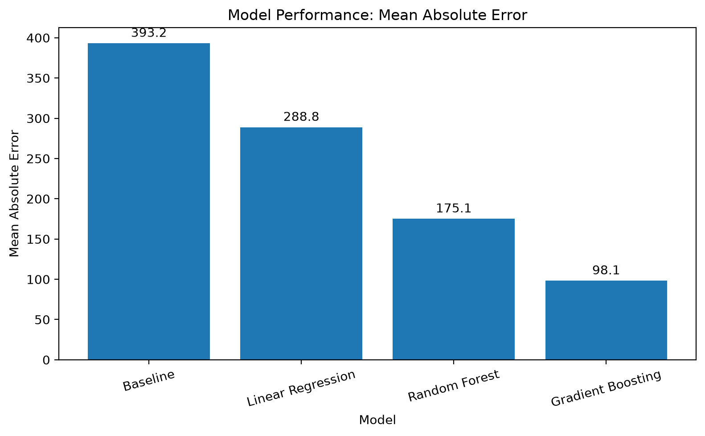
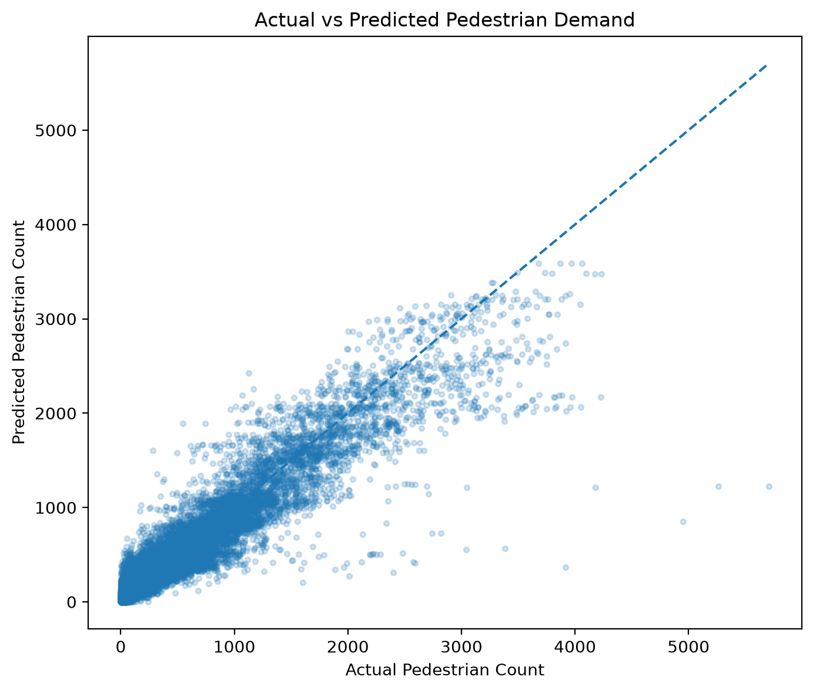
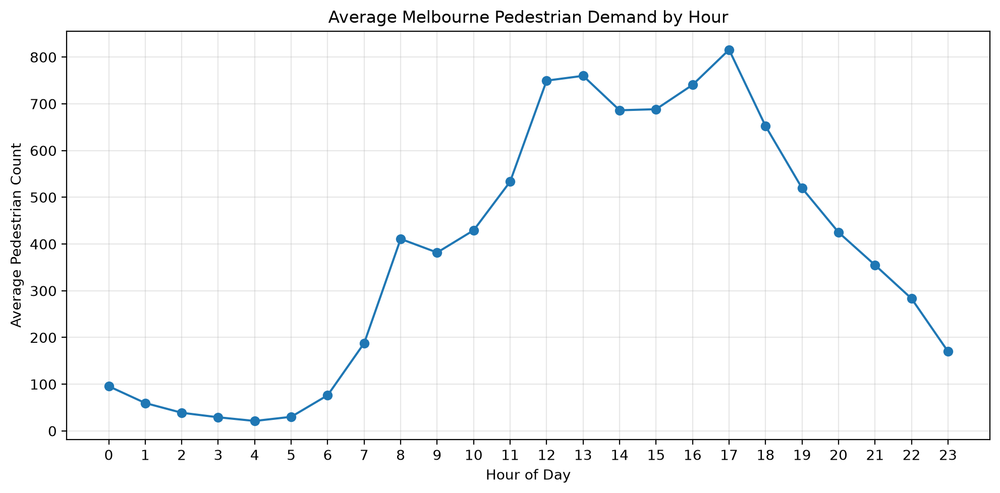

## View Full Analysis

**[Open the full Quarto report here](https://mani-jab.github.io/melbourne-pedestrian-analytics-2026/mobility_analysis.html)**

# Melbourne Pedestrian Mobility Analytics 2026

An end-to-end project analysing 500,000+ hourly pedestrian observations across Melbourne to understand mobility patterns and predict future pedestrian demand using machine learning.

The project combines exploratory data analysis, statistical testing, feature engineering and predictive modelling, with models evaluated on a chronologically held-out period to simulate forecasting unseen future demand.

## Project Overview

Pedestrian activity across Melbourne varies substantially by location, time of day and day of week. Understanding these patterns can support decisions around urban planning, transport, infrastructure and resource allocation.

This project investigates three questions:

1. **When and where is pedestrian demand highest?**
2. **Which factors are most strongly associated with pedestrian demand?**
3. **How accurately can future pedestrian activity be predicted using machine learning?**

The analysis has the following workflow:

**Data validation → Exploratory analysis → Statistical testing → Feature engineering → Machine learning → Model evaluation → Model interpretation**

## Dataset

**Source:** City of Melbourne Open Data – Pedestrian Counting System

- **505,887** hourly pedestrian observations
- **101** sensor locations represented
- Data spanning **January–August 2026**
- Hourly pedestrian counts across Melbourne's sensor network
- Supplementary sensor-location data used to provide descriptive location information

The prediction target is **hourly pedestrian demand** (`Total_of_Directions`).

## Technologies

**Language:** Python

**Data & Analysis:** pandas, NumPy, SciPy

**Machine Learning:** scikit-learn

**Visualisation:** Matplotlib

**Reporting & Development:** Quarto, VS Code, Git, GitHub

## Analysis Workflow

### 1. Data Validation & Preparation

The raw pedestrian-count and sensor-location datasets were inspected for:

- Missing values
- Duplicate observations
- Data types
- Temporal coverage
- Sensor coverage
- Merge quality

Sensor metadata was joined to the pedestrian observations to provide interpretable location descriptions.

### 2. Exploratory Data Analysis

Pedestrian demand was analysed across:

- Sensor locations
- Hour of day
- Day of week
- Weekday vs weekend periods
- Time

This revealed substantial differences in pedestrian activity across both **space and time**.

### 3. Statistical Analysis

Statistical testing was used to investigate whether observed differences in pedestrian demand between weekday and weekend periods were supported by the data rather than relying solely on visual patterns.

### 4. Feature Engineering

Temporal features were created from the timestamp, including:

- Hour of day
- Day of week
- Month
- Weekend indicator

Cyclical transformations were also investigated to represent the repeating nature of hourly and weekly time patterns.

### 5. Machine Learning

Four approaches were compared:

- Historical-average baseline
- Linear Regression
- Random Forest Regression
- Gradient Boosting Regression

Rather than randomly splitting observations, the models were trained on earlier observations and evaluated on a **future chronological holdout period**.

**Training period:** January–July 2026  
**Testing period:** 1–13 August 2026

This prevents future observations from leaking into model training and better represents a real forecasting scenario.

## Model Performance

| Model | MAE | RMSE | R² |
|---|---:|---:|---:|
| Historical Average Baseline | 393.16 | 569.14 | -0.001 |
| Linear Regression | 288.83 | 438.45 | 0.406 |
| Random Forest | 175.07 | 287.51 | 0.745 |
| **Gradient Boosting** | **98.14** | **184.49** | **0.895** |

**Gradient Boosting was the strongest-performing model**, achieving an R² of **0.895** on unseen August observations.

Its MAE of **98.14 pedestrians** represents an approximately **75% reduction in mean absolute error compared with the historical-average baseline**.

### Model Comparison



### Actual vs Predicted Demand

The final model captures the overall structure of pedestrian demand well, while the largest deviations occur during unusually high-demand observations.




## Key Findings

- **Location and hour of day were the strongest predictors of pedestrian demand.**
- Pedestrian activity follows strong recurring intraday patterns.
- Demand varies substantially between sensor locations.
- Tree-based ensemble models substantially outperformed both the baseline and linear regression.
- Gradient Boosting explained approximately **89.5% of the variation in unseen observations**.
- Prediction errors were substantially larger during unusual demand spikes.
- Several of the largest errors occurred around **Building 80 RMIT on 9 August**, where observed pedestrian counts greatly exceeded model predictions.

The error analysis suggests that historical location and time patterns explain normal pedestrian activity well, but unusual spikes may require additional contextual information.

### Pedestrian Demand Patterns

Pedestrian activity follows strong recurring patterns throughout the day, highlighting the importance of time-of-day information when modelling demand.




## Model Interpretation

Permutation feature importance was used to examine which variables contributed most strongly to predictive performance.

The analysis identified:

1. **Location**
2. **Hour of day**
3. **Day of week**

as the most influential predictors.

This aligns with the exploratory analysis: pedestrian activity is highly dependent on **where a sensor is located and when the observation occurs**.

## Limitations & Responsible Model Use

The model primarily learns recurring patterns from historical location and temporal information. It does not currently include external factors such as:

- Weather
- Major events
- Public holidays
- Public transport disruptions

As a result, the model may underpredict unusual demand spikes caused by circumstances not represented in its features.

The sensor network also represents monitored locations rather than a random sample of Melbourne. Results therefore describe pedestrian activity within the available sensor network and should not be interpreted as complete city-wide pedestrian estimates.

Predictions are best treated as **decision-support information** rather than autonomous decisions, with model performance monitored as pedestrian behaviour and sensor infrastructure evolve.

## Repository Structure

```text
melbourne-mobility-analytics/
├── data/
│   ├── pedestrian_counts_2026.csv
│   └── sensor_locations.csv
├── figures/
├── mobility_analysis.qmd
├── mobility_analysis.html
├── requirements.txt
├── .gitignore
└── README.md
```

`mobility_analysis.qmd` contains the complete analysis, Python code, methodology and interpretation.

`mobility_analysis.html` contains the rendered interactive Quarto report for easier viewing.

## Reproducing the Analysis

Clone the repository and install the required Python packages:

```bash
pip install -r requirements.txt
```

Then render the complete Quarto report:

```bash
quarto render mobility_analysis.qmd
```

## Future Improvements

The forecasting system could be extended by incorporating:

- Weather conditions
- Major event schedules
- Public holidays
- Public transport disruptions
- Longer historical periods
- Time-series cross-validation
- Hyperparameter optimisation
- Interactive forecasting dashboards

These additions could help explain unusual pedestrian-demand spikes that cannot be captured using location and temporal patterns alone.